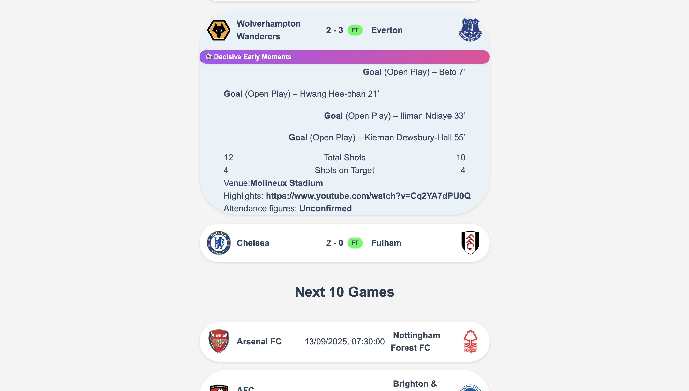

Scope of the project:

Premier-League-Hub is a web application that shows live premier league game scores, the upcoming set of results, as well as a detailed breakdown of the previous round of results. The web application uses the current date and time to automatically fetch the live game state and also the nearest previous and future fixtures.

Tech stack:

- Backend: Node.js with Express helping to define API routes that fetch and organise JSON data. 
- Frontend: Next.js to structure the website and routing, with React handling interactivity. 
- Language and Styling: CSS for visual enhancements like style; Typescript adds type safety 
- Data Sources: API 1: football-data.org (live games and future fixtures), API 2: thesportsdb.com (past results)

Features:

- Live scores with automatic updates
- Upcoming fixtures fetched dynamically by date
- Detailed breakdown of past matches, including:  
  - Match timeline of key events  
  - Shots, shots on target, attendance, venue  
  - Video highlights  
- Caching to reduce unnecessary API calls
- Automatic categorization into **previous / live / upcoming** fixtures
- Interactive UI with expandable match detail

How to run Locally:

Open a terminal and type the following: 
- git clone https://github.com/zhashi12/Premier-league-hub.git
- cd premier-league-hub
- npm install
- cd backend
- npm run dev

Open another terminal and type the following:
- cd premier-league-hub
- cd frontend
- npm run dev

Then access http://localhost:3000 on your web browser. Alternatively, the terminal should provide a clickable link.
If running locally poses an issue, you can follow the online link shown below under the Deployment header

Deployment:

The backend and frontend are both publicly deployed using vercel. The website can be viewed using any browser at any point in time using the following link: https://premier-league-hub-three.vercel.app/

Ongoing development:

Planned features include adding a league table, and email or phone notifications of users' favourite team's ongoing games.

Author:
Built by Zakariye Hashi

